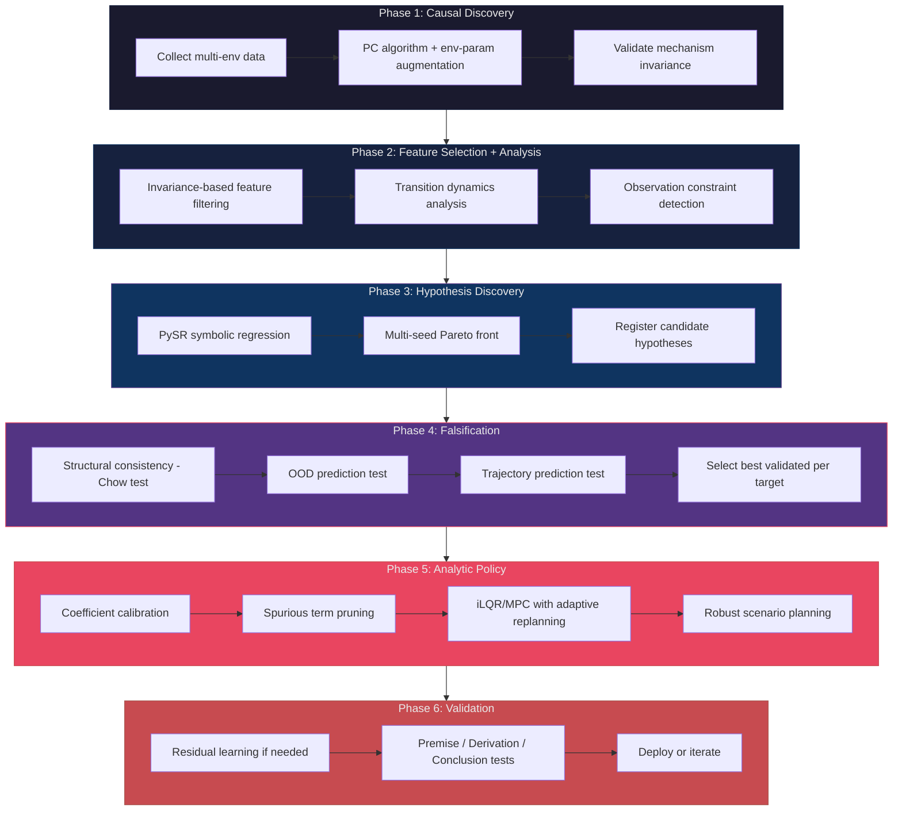

# CIRC-RL

**Causal Invariant Regularized Constrained Reinforcement Learning**

A framework for building RL agents that generalize beyond their training distribution by discovering causal structure, deriving symbolic dynamics via falsifiable scientific hypotheses, and computing analytic policies as consequences of validated models.

---

## The Problem

Standard reinforcement learning optimizes for expected return on a single training distribution:

```
pi* = argmax_pi E[R(tau)]
```

This leads to policies that:

- **Reward-hack**: exploit spurious correlations instead of learning causal mechanisms
- **Memorize**: overfit to environment-specific patterns that break under distribution shift
- **Violate safety**: achieve high reward through unintended, unsafe behaviors
- **Fail silently**: degrade catastrophically when deployed in conditions that differ from training

## The Solution

CIRC-RL treats policy optimization as a scientific discovery problem: instead of fitting a neural network to reward signals, it discovers the symbolic equations governing the environment, validates them through falsification, and derives the optimal policy analytically. The key insight is that **the optimal policy for a well-understood system is not an object to be learned -- it is a consequence to be derived**.

The framework operates through an 8-stage pipeline:

1. **Causal Discovery** -- Infer the causal graph from multi-environment data (PC algorithm with environment-parameter augmentation)
2. **Feature Selection** -- Identify causally invariant features via mechanism invariance testing
3. **Transition Analysis** -- Quantify per-environment dynamics scales and identify variant/invariant dimensions
4. **Hypothesis Generation** -- Discover symbolic dynamics and reward expressions via PySR symbolic regression
5. **Hypothesis Falsification** -- Rigorously test hypotheses via structural consistency (Chow test), OOD prediction, and trajectory prediction
6. **Analytic Policy Derivation** -- Derive optimal control via iLQR/MPC from validated symbolic models, with coefficient calibration, spurious term pruning, adaptive replanning, and robust scenario planning
7. **Residual Learning** -- Bounded neural network correction for unmodeled dynamics (skipped when analytic policy explains >98% of variance)
8. **Diagnostic Validation** -- Premise/derivation/conclusion tests that localize failures to specific pipeline components

## Benchmark Results (Pendulum-v1)

Evaluated on **50 out-of-distribution test environments** with extreme physics parameters (g=5--15, m=0.3--3.0, l=0.3--2.0):

| Metric | v2 (Analytic iLQR) | v1 (Neural PPO) | Improvement |
|--------|------------------:|----------------:|------------:|
| Mean return | **-43.7** | -1967.3 | **45x** |
| Median return | **-30.7** | -355.9 | **12x** |
| Worst return | **-222.8** | -6875.8 | **31x** |
| Std return | **41.3** | 2413.9 | **58x** |

The symbolic approach generalizes to OOD physics because the discovered equations (e.g., angular acceleration from gravity and torque) are parametrically invariant -- the functional form is the same across all environments, only the coefficients change.

## Architecture



## Key Features

- **Scientific discovery pipeline**: discovers symbolic dynamics equations, validates them through falsification, and derives analytic policies as mathematical consequences
- **Domain-agnostic**: applicable to any RL problem where environment families can be constructed and dynamics have discoverable analytic structure
- **Symbolic regression**: multi-seed PySR with sum-of-products constraints, automatic canonical coordinate detection, and Pareto-front deduplication
- **Rigorous falsification**: structural consistency (calibrated Chow test), OOD prediction, and trajectory prediction tests with MDL scoring
- **Analytic control**: iLQR/MPC with coefficient calibration, spurious term detection, adaptive replanning, and robust scenario-based planning
- **Causal discovery**: PC algorithm with environment-parameter augmentation, mechanism invariance validation
- **Diagnostic validation**: premise/derivation/conclusion tests that localize failures to specific components
- **DAG-based pipeline**: stages are orchestrated with caching and partial re-runs
- **Reproducibility**: deterministic seeding, full config logging (Hydra), git hash tracking per run

## Installation

Requires Python 3.11+. This project uses [uv](https://docs.astral.sh/uv/) for dependency management.

```bash
# Clone the repository
git clone https://github.com/AlessandroFlati/CIRC-RL.git
cd CIRC-RL

# Install uv (if not already installed)
curl -LsSf https://astral.sh/uv/install.sh | sh

# Create virtual environment and install dependencies
uv sync

# Install pre-commit hooks
uv run pre-commit install
```

### Symbolic Regression Support

```bash
# Install with PySR symbolic regression (requires Julia)
uv sync --extra symbolic
```

### GPU Support

```bash
# Install with CUDA 12.9 support
uv sync --extra cuda
```

## Quick Start

```python
from circ_rl.environments.env_family import EnvironmentFamily
from circ_rl.hypothesis.symbolic_regressor import SymbolicRegressionConfig
from circ_rl.orchestration.stages import (
    CausalDiscoveryStage,
    FeatureSelectionStage,
    TransitionAnalysisStage,
    HypothesisGenerationStage,
    HypothesisFalsificationStage,
    AnalyticPolicyDerivationStage,
)

# 1. Define environment family with parametric variation
env_family = EnvironmentFamily.from_gymnasium(
    base_env="Pendulum-v1",
    param_distributions={"g": (8.0, 12.0), "m": (0.8, 1.5), "l": (0.7, 1.3)},
    n_envs=25,
    seed=42,
)

# 2. Causal discovery (PC algorithm with env-param augmentation)
cd_output = CausalDiscoveryStage(
    env_family=env_family, n_transitions_per_env=5000,
    include_env_params=True, seed=42,
).run({})

# 3. Feature selection + transition analysis
fs_output = FeatureSelectionStage().run({"causal_discovery": cd_output})
ta_output = TransitionAnalysisStage().run(
    {"causal_discovery": cd_output, "feature_selection": fs_output}
)

# 4. Discover symbolic dynamics via PySR
sr_config = SymbolicRegressionConfig(max_complexity=30, n_iterations=80)
hg_output = HypothesisGenerationStage(
    include_env_params=True, sr_config=sr_config,
).run({"causal_discovery": cd_output, "feature_selection": fs_output,
       "transition_analysis": ta_output})

# 5. Falsify hypotheses (structural consistency, OOD, trajectory tests)
hf_output = HypothesisFalsificationStage().run(
    {"hypothesis_generation": hg_output, "causal_discovery": cd_output}
)

# 6. Derive analytic policy (iLQR with coefficient calibration)
apd_output = AnalyticPolicyDerivationStage(env_family=env_family).run(
    {"hypothesis_falsification": hf_output, "transition_analysis": ta_output,
     "causal_discovery": cd_output}
)
policy = apd_output["analytic_policy"]

# Use the policy
import numpy as np
action = policy.get_action(np.array([1.0, 0.0, 0.0]), env_idx=0)
```

> **Note:** Requires PySR for symbolic regression: `pip install 'circ-rl[symbolic]'`. See `experiments/pendulum_v2_real.py` for the full 8-stage pipeline and `experiments/pendulum_compare.py` for v1 vs v2 evaluation.

## Project Structure

```
circ_rl/
    causal_discovery/        # Phase 1: PC, GES, FCI algorithms; causal graph; mechanism validation
    feature_selection/       # Phase 2: invariance-based feature filtering; transition analysis
    hypothesis/              # Phase 3-4: symbolic expressions, PySR regression, hypothesis register,
                             #   falsification engine, structural consistency, spurious detection
    analytic_policy/         # Phase 5: iLQR/MPC solvers, coefficient calibrator, robust MPC,
                             #   hypothesis classifier, action normalizer
    policy/                  # Neural policies: CausalPolicy, ResidualPolicy, CompositePolicy
    training/                # Trajectory buffers, rollout workers, residual trainer
    diagnostics/             # Phase 7: premise, derivation, conclusion tests; diagnostic suite
    evaluation/              # MDL scoring, constraint verification
    environments/            # EnvironmentFamily, DataCollector
    orchestration/           # 8-stage pipeline, caching, checkpointing
    constraints/             # Constraint functions, Lagrange multiplier management
    regularization/          # Parametric, functional, path, IB complexity penalties
    invariance/              # IRM penalties, worst-case optimization
    utils/                   # Seeding, tensor ops, logging, checkpointing
configs/                     # Hydra YAML configuration files
tests/
    unit/                    # pytest + hypothesis property-based tests
    integration/             # Gymnasium-based integration tests
experiments/                 # Experiment scripts (pendulum_v2_real.py, pendulum_compare.py, etc.)
docs/                        # Theoretical extensions and documentation
```

## Roadmap

### Benchmarks

| Benchmark | Domain | Environment Family | Status |
|-----------|--------|-------------------|--------|
| Pendulum-v1 | Classic control | Gravity, mass, length randomization (50 OOD envs) | **Done** (v2: -43.7 mean, v1: -1967.3) |
| CartPole variants | Classic control | Gravity, mass, pole length randomization | Planned |
| MuJoCo locomotion | Continuous control | Friction, limb mass, terrain variation | Planned |
| Custom financial env | Sequential decision | Market regime shifts as environments | Planned |

### Evaluation Protocol

- **Out-of-distribution generalization**: test on environments with physics parameters outside the training range (e.g., train on g=8--12, test on g=5--15)
- **Head-to-head comparison**: v1 (neural CausalPolicy + PPO) vs v2 (symbolic dynamics + iLQR) on identical test environments
- **Diagnostic validation**: premise/derivation/conclusion tests to localize failures
- **Ablation studies**: systematically disable each pipeline component (calibration, spurious detection, adaptive replanning, robust MPC)

### Milestones

- [x] Core infrastructure (environments, config, logging, orchestration)
- [x] Causal discovery module (PC algorithm, graph validation, env-param augmentation)
- [x] Feature selection via causal invariance (mechanism invariance testing)
- [x] Symbolic hypothesis generation (PySR multi-seed, Pareto front deduplication)
- [x] Hypothesis falsification (structural consistency, OOD, trajectory tests)
- [x] Analytic policy derivation (iLQR/MPC from validated symbolic models)
- [x] Algorithmic improvements (coefficient calibration, spurious detection, adaptive replanning, robust MPC)
- [x] Residual learning (bounded neural correction)
- [x] Diagnostic validation (premise/derivation/conclusion tests)
- [x] Pendulum-v1 benchmark (v1 neural vs v2 analytic, 50 OOD test environments)
- [ ] Additional benchmarks (CartPole, MuJoCo locomotion, financial environments)
- [ ] Documentation and tutorials

## Contributing

This project follows the **Git Flow** branching model:

- `main`: stable releases only
- `develop`: integration branch for features
- `feature/*`: new features branch from `develop`
- `release/*`: release preparation branches
- `hotfix/*`: critical fixes branching from `main`

### Development Setup

```bash
# Create a feature branch
git checkout develop
git checkout -b feature/my-feature

# Install dev dependencies
uv sync --extra dev

# Run tests
uv run pytest

# Run linting and type checking
uv run ruff check .
uv run pyright

# Run pre-commit on all files
uv run pre-commit run --all-files
```

### Code Quality Requirements

- All code must pass `ruff check` and `ruff format --check`
- All code must pass `pyright` in strict mode
- All public APIs must have Sphinx-compatible docstrings
- All tensor operations must include shape comments
- Tests are required for all new functionality

## Security

### Reporting Vulnerabilities

If you discover a security vulnerability, please report it responsibly:

1. **Do not** open a public issue
2. Email the maintainer directly with a description of the vulnerability
3. Include steps to reproduce if possible
4. Allow reasonable time for a fix before public disclosure

### Security Considerations

- **Environment sandboxing**: RL environments may execute arbitrary dynamics; run untrusted environments in isolated processes
- **Model serialization**: only load model checkpoints from trusted sources (pickle deserialization can execute arbitrary code)
- **Configuration injection**: Hydra configs are loaded from YAML; validate config sources before loading
- **Dependency supply chain**: pin all dependency versions; verify checksums in CI

## Theoretical Foundation

The full mathematical framework is documented in [`CIRC-RL_Framework.md`](CIRC-RL_Framework.md), including:

- Structural Causal Model formalization for RL
- Causal invariance definitions and environment families
- Lexicographic multi-objective optimization formulation
- Theoretical guarantees (causal generalization bound, MDL sample complexity, PAC-safe RL)
- Fundamental limitations and epistemological boundaries

### Key References

- Pearl, J. (2009). *Causality: Models, Reasoning, and Inference*
- Arjovsky, M. et al. (2019). *Invariant Risk Minimization*
- Rissanen, J. (1978). *Modeling by Shortest Data Description*
- Altman, E. (1999). *Constrained Markov Decision Processes*
- Achiam, J. et al. (2017). *Constrained Policy Optimization*

## License

Copyright (C) 2025-2026 Alessandro Flati

This program is free software: you can redistribute it and/or modify it under the terms of the **GNU Affero General Public License** as published by the Free Software Foundation, either version 3 of the License, or (at your option) any later version.

See [LICENSE](LICENSE) for the full license text.

## Citation

```bibtex
@software{flati2025circrl,
  author = {Flati, Alessandro},
  title = {CIRC-RL: Causal Invariant Regularized Constrained Reinforcement Learning},
  year = {2025},
  url = {https://github.com/AlessandroFlati/CIRC-RL},
  license = {AGPL-3.0-or-later}
}
```

## Acknowledgments

This framework synthesizes ideas from causal inference (Pearl, Spirtes, Glymour), robust statistics (Huber, Hampel), information theory (Rissanen, Cover, Tishby), robust optimization (Ben-Tal, Nemirovski), safe RL (Altman, Achiam), and domain randomization (Tobin, Sadeghi).
