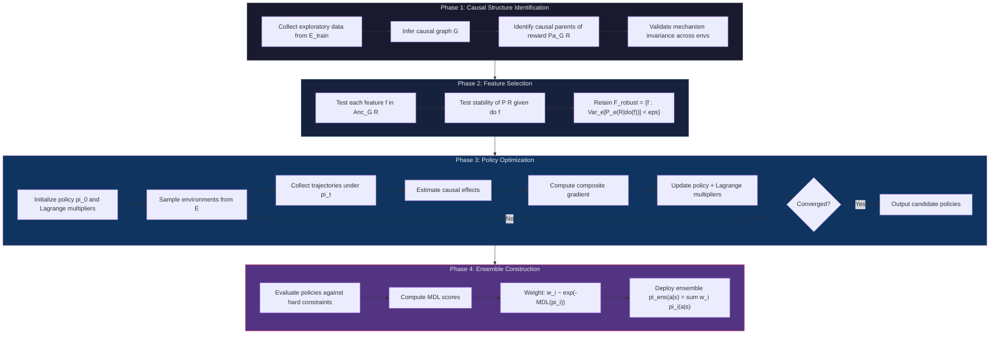

# CIRC-RL

**Causal Invariant Regularized Constrained Reinforcement Learning**

A framework for building RL agents that generalize beyond their training distribution by exploiting causal structure, enforcing cross-environment invariance, penalizing complexity, and satisfying safety constraints.

---

## The Problem

Standard reinforcement learning optimizes for expected return on a single training distribution:

```
pi* = argmax_pi E[R(tau)]
```

This leads to policies that:

- **Reward-hack**: exploit spurious correlations instead of learning causal mechanisms
- **Memorize**: overfit to environment-specific patterns that break under distribution shift
- **Violate safety**: achieve high reward through unintended, unsafe behaviors
- **Fail silently**: degrade catastrophically when deployed in conditions that differ from training

## The Solution

CIRC-RL addresses these failure modes through four integrated components organized as a lexicographic multi-objective optimization:

1. **Causal Policy Learning** -- Learn policies that maximize interventional effects (do-calculus) rather than observational correlations, distinguishing true mechanisms from spurious associations.

2. **Invariant Risk Minimization** -- Train across environment families and optimize for worst-case performance, ensuring policies exploit mechanisms that are stable under distributional shifts.

3. **Complexity Regularization** -- Penalize parametric, functional, and path complexity (MDL principle / Occam's razor), preventing memorization of environment-specific patterns.

4. **Constrained Optimization** -- Enforce domain-specific safety constraints via Lagrangian methods or projection, encoding prior knowledge about unacceptable behaviors.

## Architecture



## Key Features

- **Domain-agnostic**: applicable to any RL problem where environment families can be constructed
- **Custom RL backbone**: purpose-built policy optimization algorithm tailored to CIRC-RL's multi-objective needs, built on PyTorch with Stable-Baselines3 infrastructure (VecEnv, logging, replay buffers)
- **DAG-based pipeline**: phases are orchestrated as a directed acyclic graph with caching and partial re-runs
- **Causal discovery**: custom implementation of causal graph inference algorithms (PC, GES, FCI), referencing causal-learn and DoWhy
- **Multi-environment training**: SB3 VecEnv extensions for parallel environment family sampling
- **Safety-first**: lexicographic priorities ensure constraints are satisfied before optimizing performance
- **Reproducibility**: deterministic seeding, full config logging (Hydra), git hash tracking per run

## Installation

Requires Python 3.11+. This project uses [uv](https://docs.astral.sh/uv/) for dependency management.

```bash
# Clone the repository
git clone https://github.com/AlessandroFlati/CIRC-RL.git
cd CIRC-RL

# Install uv (if not already installed)
curl -LsSf https://astral.sh/uv/install.sh | sh

# Create virtual environment and install dependencies
uv sync

# Install pre-commit hooks
uv run pre-commit install
```

### GPU Support

```bash
# Install with CUDA 12.9 support
uv sync --extra cuda
```

## Quick Start

```python
from circ_rl.training import CIRCTrainer
from circ_rl.causal_discovery import CausalGraphBuilder
from circ_rl.environments import EnvironmentFamily
from circ_rl.constraints import ConstraintSet

# Define environment family
env_family = EnvironmentFamily.from_gymnasium(
    base_env="CartPole-v1",
    param_distributions={
        "gravity": (9.0, 11.0),
        "masscart": (0.5, 2.0),
    },
    n_envs=10,
)

# Define safety constraints
constraints = ConstraintSet()
constraints.add_expected_cost("pole_angle_violation", threshold=0.05)

# Build causal graph (or provide domain knowledge)
causal_graph = CausalGraphBuilder.discover(env_family, method="pc")

# Train with CIRC-RL
trainer = CIRCTrainer(
    env_family=env_family,
    causal_graph=causal_graph,
    constraints=constraints,
    config_path="configs/cartpole.yaml",
)
ensemble_policy = trainer.run()
```

> **Note:** This API is illustrative and will evolve as the implementation matures. See the framework document for the full theoretical specification.

## Project Structure

```
CIRC-RL/
    causal_discovery/        # Phase 1: causal graph inference (PC, GES, FCI)
    feature_selection/       # Phase 2: causal invariance-based feature filtering
    policy/                  # Policy networks, causal Q-functions, representations
    training/                # Phase 3: multi-env policy optimization, Lagrangian updates
    evaluation/              # Phase 4: ensemble construction, MDL scoring
    environments/            # SB3 VecEnv extensions, environment family management
    constraints/             # Constraint definitions, Lagrange multiplier management
    regularization/          # Complexity penalties (parametric, functional, path, IB)
    invariance/              # IRM penalties, worst-case optimization
    orchestration/           # DAG-based pipeline, caching, checkpointing
    configs/                 # Hydra YAML configuration files
    tests/
        unit/                # pytest + hypothesis property-based tests
        integration/         # Gymnasium-based integration tests
    experiments/             # Experiment scripts and result artifacts
    docs/                    # Sphinx documentation source
```

## Roadmap

### Planned Benchmarks

| Benchmark | Domain | Environment Family | Status |
|-----------|--------|-------------------|--------|
| CartPole variants | Classic control | Gravity, mass, pole length randomization | Planned |
| MuJoCo locomotion | Continuous control | Friction, limb mass, terrain variation | Planned |
| Procgen suite | Procedural generation | Level seeds as environments | Planned |
| Custom financial env | Sequential decision | Market regime shifts as environments | Planned |

### Evaluation Protocol

- **Within-family generalization**: hold-out environments from the same family
- **Cross-family transfer**: evaluate on environment families not seen during training
- **Ablation studies**: systematically disable each CIRC-RL component
- **Baseline comparisons**: vanilla PPO, SAC, domain randomization, EPOpt

### Milestones

- [ ] Core infrastructure (environments, config, logging, orchestration)
- [ ] Causal discovery module (PC algorithm, graph validation)
- [ ] Feature selection via causal invariance
- [ ] Custom policy optimization with Lagrangian constraints
- [ ] Invariant risk minimization integration
- [ ] Complexity regularization (parametric, functional, information bottleneck)
- [ ] Ensemble construction with MDL weighting
- [ ] Benchmark suite and evaluation pipeline
- [ ] Documentation and tutorials

## Contributing

This project follows the **Git Flow** branching model:

- `main`: stable releases only
- `develop`: integration branch for features
- `feature/*`: new features branch from `develop`
- `release/*`: release preparation branches
- `hotfix/*`: critical fixes branching from `main`

### Development Setup

```bash
# Create a feature branch
git checkout develop
git checkout -b feature/my-feature

# Install dev dependencies
uv sync --extra dev

# Run tests
uv run pytest

# Run linting and type checking
uv run ruff check .
uv run pyright

# Run pre-commit on all files
uv run pre-commit run --all-files
```

### Code Quality Requirements

- All code must pass `ruff check` and `ruff format --check`
- All code must pass `pyright` in strict mode
- All public APIs must have Sphinx-compatible docstrings
- All tensor operations must include shape comments
- Tests are required for all new functionality

## Security

### Reporting Vulnerabilities

If you discover a security vulnerability, please report it responsibly:

1. **Do not** open a public issue
2. Email the maintainer directly with a description of the vulnerability
3. Include steps to reproduce if possible
4. Allow reasonable time for a fix before public disclosure

### Security Considerations

- **Environment sandboxing**: RL environments may execute arbitrary dynamics; run untrusted environments in isolated processes
- **Model serialization**: only load model checkpoints from trusted sources (pickle deserialization can execute arbitrary code)
- **Configuration injection**: Hydra configs are loaded from YAML; validate config sources before loading
- **Dependency supply chain**: pin all dependency versions; verify checksums in CI

## Theoretical Foundation

The full mathematical framework is documented in [`CIRC-RL_Framework.md`](CIRC-RL_Framework.md), including:

- Structural Causal Model formalization for RL
- Causal invariance definitions and environment families
- Lexicographic multi-objective optimization formulation
- Theoretical guarantees (causal generalization bound, MDL sample complexity, PAC-safe RL)
- Fundamental limitations and epistemological boundaries

### Key References

- Pearl, J. (2009). *Causality: Models, Reasoning, and Inference*
- Arjovsky, M. et al. (2019). *Invariant Risk Minimization*
- Rissanen, J. (1978). *Modeling by Shortest Data Description*
- Altman, E. (1999). *Constrained Markov Decision Processes*
- Achiam, J. et al. (2017). *Constrained Policy Optimization*

## License

Copyright (C) 2025 Alessandro Flati

This program is free software: you can redistribute it and/or modify it under the terms of the **GNU Affero General Public License** as published by the Free Software Foundation, either version 3 of the License, or (at your option) any later version.

See [LICENSE](LICENSE) for the full license text.

## Citation

```bibtex
@software{flati2025circrl,
  author = {Flati, Alessandro},
  title = {CIRC-RL: Causal Invariant Regularized Constrained Reinforcement Learning},
  year = {2025},
  url = {https://github.com/AlessandroFlati/CIRC-RL},
  license = {AGPL-3.0-or-later}
}
```

## Acknowledgments

This framework synthesizes ideas from causal inference (Pearl, Spirtes, Glymour), robust statistics (Huber, Hampel), information theory (Rissanen, Cover, Tishby), robust optimization (Ben-Tal, Nemirovski), safe RL (Altman, Achiam), and domain randomization (Tobin, Sadeghi).
